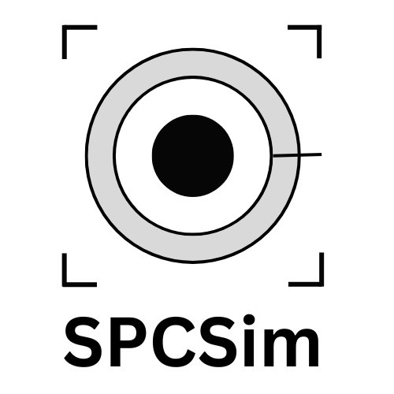

<p align="center">
  
</p>

# SPCSim: A Fast, Efficient, and Modular Single-Photon Camera Simulator 

SPCSim (Single-Photon Camera Simulator) is a PyTorch-based library for simulating 3D imaging systems using single-photon cameras (SPCs). 
The current version of SPCSim includes implementations of 3D SPCs used in direct time of flight (dToF) applications. 
SPCSim enables users to design customized 3D imaging pipelines and simulate SPC measurements for different scene distances and illumination conditions.

### [Documentation Link](https://kaustubh-sadekar.github.io/SPCSimLib/)

## Key features of SPCSim

* Vectorized PyTorch implementations with GPU acceleration
* Quick and easy to use API to encourage the research related to single photon cameras
* Reduced simulation and overall experimentation time
* Modular and customizable framework to simulate/emulate real senor data and SPC data processing pipelines
* PerPixelLoader class to simulate multiple independent runs, in parallel, for each combination of scene distances and illumination conditions.
* Implementation of different SPC data compression methods
* Implementation of postprocessing algorithms to estimate scene distances from compressed SPC measurements
* Implementation of customizable active illumination laser (approximated as a gaussian) with control over the laser FWHM, power, and repetition rate.
* Utility functions to plot and visualize different data modalities.

## Citing SPCSim
If you find this tool helpful, please cite our [paper](https://link.springer.com/chapter/10.1007/978-3-031-73039-9_22):

```
@InProceedings{10.1007/978-3-031-73039-9_22,
author="Sadekar, Kaustubh
and Maier, David
and Ingle, Atul",
editor="Leonardis, Ale{\v{s}}
and Ricci, Elisa
and Roth, Stefan
and Russakovsky, Olga
and Sattler, Torsten
and Varol, G{\"u}l",
title="Single-Photon 3D Imaging with Equi-Depth Photon Histograms",
booktitle="Computer Vision -- ECCV 2024",
year="2025",
publisher="Springer Nature Switzerland",
address="Cham",
pages="381--398",
isbn="978-3-031-73039-9"
}

```


## Setup steps for SPCSim library

1. Create a new virtual environment and install the required libraries

```
git clone https://github.com/kaustubh-sadekar/SPCSimLib.git
cd SPCSimLib/
conda create -n "spcsim_env" python=3.9.12
conda activate spcsim_env
pip install -r requirements.txt
pip install -U pip setuptools
```

2. Install SPCSim

```

pip install .

```

# Acknowledgements

This work was supported in part by NSF ECCS-2138471.


